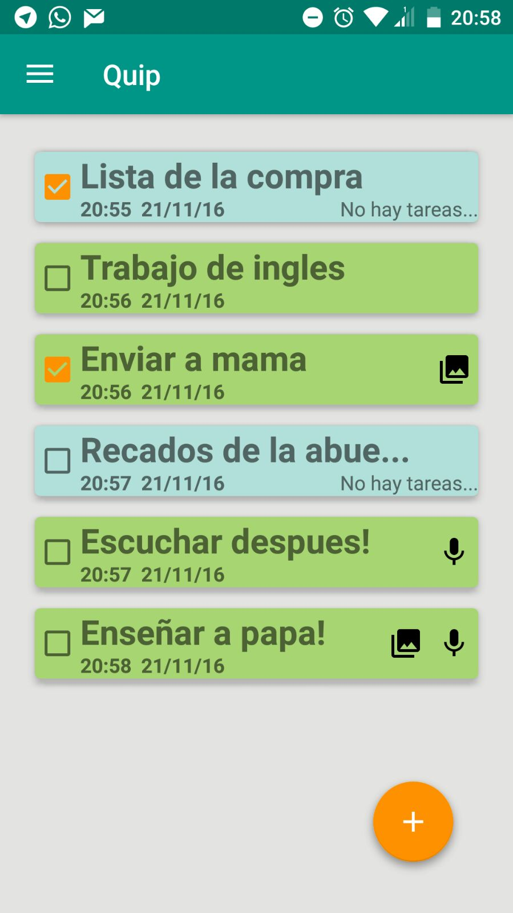
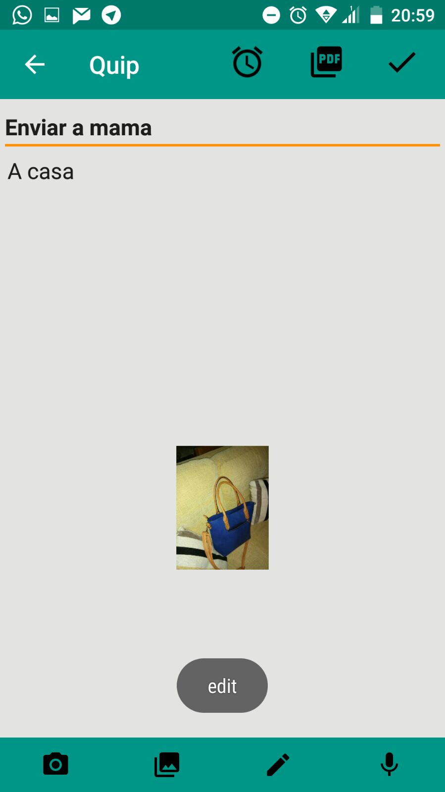
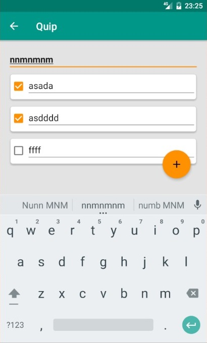

###QUIP
### ¿ Que es Quip ?
Quip es una aplicación para teléfonos Android con la que podrás anotar todo lo que quieras en cualquier momento.

### Características
Con Quip puedes crear notas y listas y puedes añadir los siguientes elementos:
<ul>
<li>Imágenes.</li>
<li>Notas de audio.</li>
<li>Dibujos.</li>
<li>Fotografías.</li>
<li>Tareas.</li>
<li>Recordatorios.</li>
</ul>

### No pierdas tus notas
Con Quip puedes guardar tus notas en PDF para que no las pierdas nunca y puedas verlas en cualquier dispositivo.

### Autores
<ul>
<li>Jose Antonio López</li>
<li>Pablo Maciá</li>
<li>Sergio Marín</li>
</ul>
### Contacto
grupo5dam2@gmail.com
